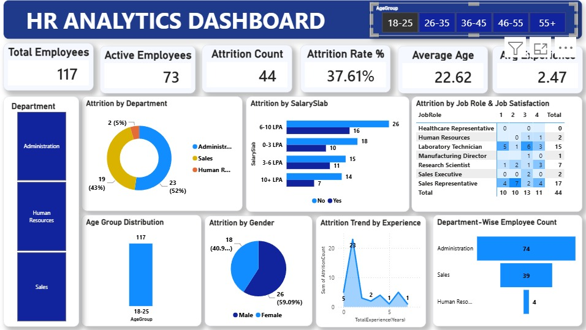
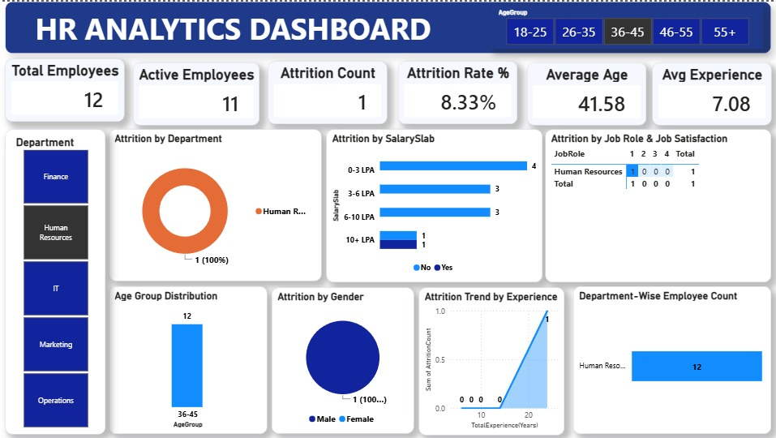
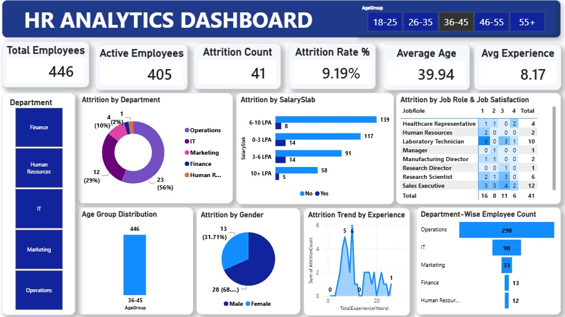
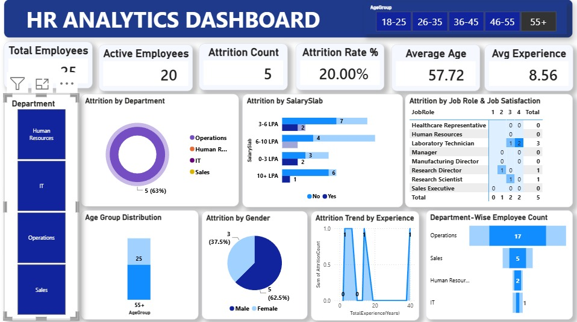

# 📊 HR Analytics Dashboard


 An interactive HR Analytics Dashboard built using **Power BI** to analyze employee attrition, workforce trends, and department-wise insights.

---

## 📌 Project Overview

This dashboard helps HR teams understand key workforce metrics through interactive visualizations and filters across different age groups and departments.

---

## 🎯 Objectives 

- 🔍 Identify key factors driving employee attrition
- 📈 Analyze department-wise employee distribution
- 💰 Understand salary slab impact on attrition
- 👥 Study gender and age group trends
- ⭐ Correlate job role with job satisfaction

---

## 🛠️ Tools & Technologies

| Tool | Purpose |
|------|---------|
|  | Dashboard & Visualization |
|  | Data Preparation |
|  | Raw Dataset |

---

## 📁 Repository Structure
```
HR-Analytics-Dashboard/
│
├── 📊 HR-Analytics Dashboard.pbix   # Power BI project file
├── 📄 HR_Analytics-4.csv            # Dataset
├── 🖼️ image1.jpeg                   # Dashboard - Age 18-25
├── 🖼️ image2.jpeg                   # Dashboard - Age 36-45
├── 🖼️ image3.jpeg                   # Dashboard - Age 36-45 HR
├── 🖼️ image4.jpeg                   # Dashboard - Age 55+
└── 📝 README.md                     # Project documentation

```
## 📸 Dashboard Preview

### 🔵 Age Group 18-25


### 🔵 Age Group 36-45


### 🔵 Age Group 36-45 (HR Focus)


### 🔵 Age Group 55+


---

## 🚀 How to Use

1. Clone this repository
```bash
git clone https://github.com/Aditya-deshmukh-1410/HR-Analytics-Dashboard.git
```
2. Open `HR-Analytics Dashboard.pbix` in **Power BI Desktop**
3. Explore interactive filters by **Age Group** and **Department**

---

## 🏷️ Topics

`power-bi` `hr-analytics` `data-visualization` `attrition-analysis` `business-intelligence` `dashboard` `data-analysis` `hr-dashboard` `powerbi-dashboard` `workforce-analytics`

---

## 👨‍💻 Author

**Aditya Deshmukh**  
[](https://github.com/Aditya-deshmukh-1410)

---

⭐ **If you found this project helpful, please give it a star!** ⭐
